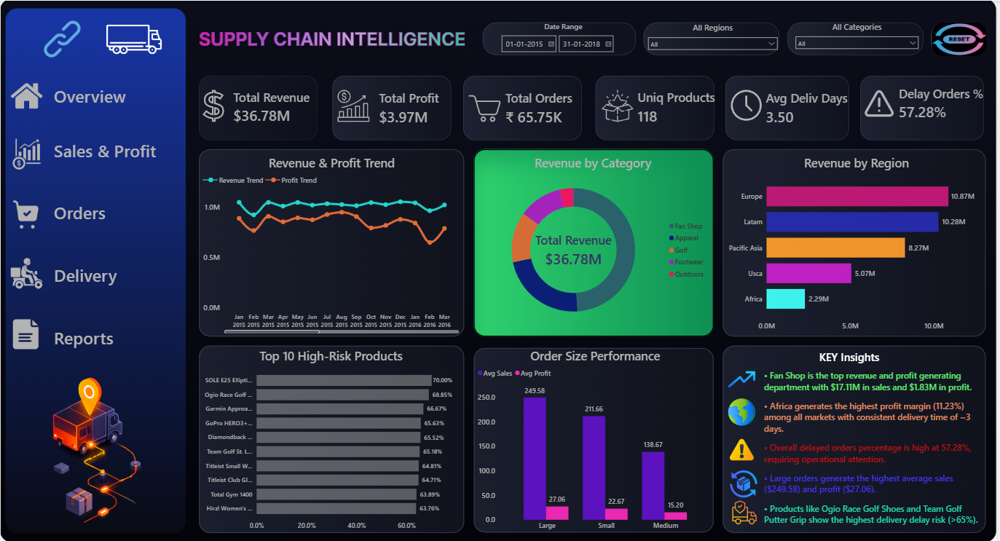

# Supply_Chain_Intelligence_Analytics

## Logistics & Supply Chain Data Analytics Project

An end-to-end supply chain analytics project that transforms raw logistics transactions into actionable operational intelligence using Python, SQL Server, and Power BI.

This project focuses on:

* Data Cleaning & Feature Engineering
* SQL-based Business Analysis
* Logistics & Delivery Analytics
* Executive KPI Reporting
* Interactive Power BI Dashboard Development

---

# Dashboard Preview



---

# Project Overview

The Supply Chain Intelligence Analytics Platform is a complete analytics workflow that starts from raw CSV logistics data and transforms it into executive-level business intelligence.

The project workflow includes:

* Python EDA & Data Cleaning
* SQL Server Business Analysis
* Power BI Dashboard Visualization
* KPI Reporting & Operational Insights

The platform helps businesses analyze:

* Shipping delays
* Product risk
* Regional performance
* Profitability trends
* Customer behavior
* Order performance

---

# Dataset Information

* **Dataset Type:** Supply Chain / Retail Logistics
* **Dataset Level:** Order & Shipment Transaction Level
* **Raw Dataset Size:** 180,519 rows × 20 columns
* **Final Cleaned Dataset:** 180,511 rows × 35 columns
* **Date Range:** Jan 2015 – Jan 2018
* **Markets Covered:** Europe, LATAM, USCA, Africa, Pacific Asia

---

# Business Problem

This project answers important supply chain business questions such as:

* Which products and regions experience the highest shipping delays?
* Which departments generate high revenue but lower margins?
* Which products create operational risk?
* Which customer segments contribute most revenue?
* Which months generate peak sales?
* How can executives monitor KPIs using one dashboard?

---

# Tools & Technologies Used

| Tool                | Purpose                   |
| ------------------- | ------------------------- |
| Python              | Data Cleaning & EDA       |
| Pandas              | Data Manipulation         |
| NumPy               | Numerical Operations      |
| SQL Server          | Business Analysis         |
| Power BI            | Dashboard & KPI Reporting |
| Jupyter Notebook    | Development Environment   |
| SQLAlchemy + pyodbc | Python to SQL Export      |

---

# Project Architecture

```text id="c8h0oq"
Raw CSV → Python Cleaning → SQL Server → Power BI Dashboard → Final Report
```

Workflow:

1. Raw logistics dataset imported from CSV
2. Python used for preprocessing and feature engineering
3. SQL Server used for business analysis queries
4. Power BI used for dashboard development
5. Final report & presentation created for business insights

---

# Python Data Cleaning Pipeline

The dataset was cleaned and transformed using Python and Pandas.

### Major Cleaning Operations

* Removed duplicate rows
* Standardized column names
* Cleaned categorical text values
* Converted date columns into datetime format
* Extracted year, month, quarter, weekday
* Created engineered features:

  * shipping_delay_days
  * delivery_performance
  * is_late_delivery
  * profit_margin_pct
  * revenue_per_unit
  * order_size
  * profit_type
  * sales_tier
* Validated zero missing values
* Exported cleaned dataset for SQL analysis

Final cleaned dataset:

* 180,511 rows
* 35 columns
* Zero duplicates
* Zero missing values

---

# SQL Server Analysis

SQL Server was used to generate business insights related to:

* Revenue & Profit
* Shipping Risk
* Delivery Delay Patterns
* Category Performance
* Regional Performance
* Customer Segments
* Product Risk Analysis
* Operational Efficiency
* Order Size Performance

### Key Findings

* Total Revenue: $36.78M
* Total Profit: $3.97M
* Consumer segment generated highest revenue
* Fan Shop generated highest department-level sales
* Standard Class had the highest late delivery volume
* Africa achieved highest average profit margin
* Large orders generated highest average sales and profit
* Delayed deliveries reduced profitability

---

# Power BI Dashboard Features

The Power BI dashboard includes:

* KPI Cards
* Revenue & Profit Trend Analysis
* Revenue by Region
* Revenue by Category
* High-Risk Product Analysis
* Order Size Performance
* Executive Insight Panel
* Interactive Filters & Slicers

### KPI Cards

* Total Revenue
* Total Profit
* Total Orders
* Unique Products
* Average Delivery Days
* Delayed Orders %

---

# Key Insights

* Total Revenue reached $36.78M
* Total Profit reached $3.97M
* Fan Shop generated highest revenue & profit
* Delayed orders reached 57.28%
* Africa showed highest operational efficiency
* Large orders produced highest average sales & profit
* Several products showed delivery risk above 65%

---

# Repository Structure

```text id="4l5vpi"
Supply-Chain-Intelligence-Analytics-Platform/
│
├── dataset/
│   └── supply_chain.csv
│
├── notebook/
│   └── Supply Chain Data Cleaning.ipynb
│
├── sql_queries/
│   └── supply_chain.sql
│
├── powerbi_dashboard/
│   └── supply.pbix
│
├── report/
│   └── Report_Supply_Chain_Intelligence.pdf
│
├── presentation/
│   └── Supply-Chain-Intelligence-Analytics-Platform-presentation.pdf
│
├── screenshots/
│   └── dashboard.png
│
├── README.md
├── LICENSE
└── .gitignore
```

---

# Future Scope

* Machine Learning-based delay prediction
* Live shipment tracking integration
* Supplier risk scoring
* AI-powered KPI assistant
* Real-time Power BI dashboard refresh
* Automated logistics alerts

---

# Disclaimer

This project is created for educational and portfolio purposes only. The dataset used in this project is sourced from publicly available supply chain and logistics records.

---

# Author

## Miryala Yashwanth

* Python
* SQL Server
* Power BI
* Data Analytics
* Supply Chain Analytics
